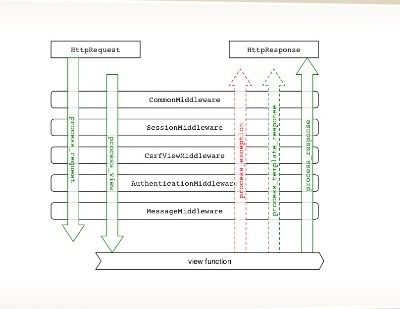

# Understanding Django Middlewares

This a very basic tutorial on Django-middlewares. We'll try to understand middlewares and write one of our own. The pre-requisite for thus tutorial is nothing but knowing the Django application structure and what are requests/responses.

## What are Middlewares?

The name sounds all fancy and stuff but it's quite straightforward if you think about it. We'll take an analogy and compare it with what it actually means and try to know it better.

According to [Docs](https://docs.djangoproject.com/en/2.0/topics/http/middleware/)
> Middleware is a framework of hooks into Django's request/response processing.
> It’s a light, low-level “plugin” system for globally altering Django’s input or output.

Let's consider a situation where you use 3 different kinds of softwares. For example, You use X for builds, Y for documenataion and Z for development purposes. But then you now want to integrate all of this into one big system to keep your software updated.

If you go ahead and start doing it manually, it may take a long period of time. But somehow you come up with a framework that reads the input/output of your resources and gives an overall correct output for an input.

In other words, the output generated by X can be used by Y and Z.
So basically, Middleware passes data between 2 or more applications.

Examples of operations perfromed by Middlewares:

- HTTP authentication
- Session management
- Encryption
- Validation


## How do Django Middleware work?

The following picture shows the working of Django middlewares.



```python
MIDDLEWARE_CLASSES = [
    'django.middleware.security.SecurityMiddleware',
    'django.contrib.sessions.middleware.SessionMiddleware',
    'django.middleware.common.CommonMiddleware',
    'django.middleware.csrf.CsrfViewMiddleware',
    'django.contrib.auth.middleware.AuthenticationMiddleware',
    'django.contrib.auth.middleware.SessionAuthenticationMiddleware',
    'django.contrib.messages.middleware.MessageMiddleware',
    'django.middleware.clickjacking.XFrameOptionsMiddleware',
]
```

Django applies the above middleware order in a top-down manner. Each Middleware class is a layer that wraps the view fuction. When the request passes through all the layers one by one, a response is generated and it again goes through all the layers on it's way back out.

## Writing a custom Middleware

Now that we know what is a middleware and how actually it works, we can write your own middlware. For this I'll be showing you a very simple example of a custom middleware.
Remind you that the practice followed is as per the Django documenataion.


In very simple terms, it is much like a view function.
The only thing we need to care about is that there are 2 hooks avaliable for request and 3 for reponse.

Before calling the view, in the request phase, the avaliable hooks are:
- process_request()
- process_view()

After calling the view, in the response phase, the available hooks are:

- process_exception()
- process_template_response()
- process_response()

While writing a middleware, all we need to do is define one or more of the above functions as per our need.

Let's suppose that we have a Django app that has the following `models.py` file.

```python
# -*- coding: utf-8 -*-
from __future__ import unicode_literals

from django.db import models

# Create your models here.


class Movies(models.Model):
    first_name = models.CharField(max_length=50)
    last_name = models.CharField(max_length=50)
    release_date = models.DateTimeField(default=datetime.now, blank=True)

    def __unicode__(self):
        return self.first_name
```

And now create a file where you define your custom middleware that uses the above model. Let's call this file as `moviemiddleware.py`

```python
from .models import Musician


class GetMovies(object):
    def process_request(self, request):
        print ('"The Dark Knight is the best superhero movie of all time"')
```

Now in your `settings.py` file,

```python
MIDDLEWARE = [
    'music.moviemiddleware.GetMovies',
    'django.middleware.security.SecurityMiddleware',
    'django.contrib.sessions.middleware.SessionMiddleware',
    'django.middleware.common.CommonMiddleware',
    'django.middleware.csrf.CsrfViewMiddleware',
    'django.contrib.auth.middleware.AuthenticationMiddleware',
    'django.contrib.messages.middleware.MessageMiddleware',
    'django.middleware.clickjacking.XFrameOptionsMiddleware',
]
```

Note that the order of middlewares is very important. When you run your application, It should output the following:

```python
Starting development server at http://127.0.0.1:8000/
Quit the server with CONTROL-C.
'Dark Knight is the best superhero movie of all time!'
```
